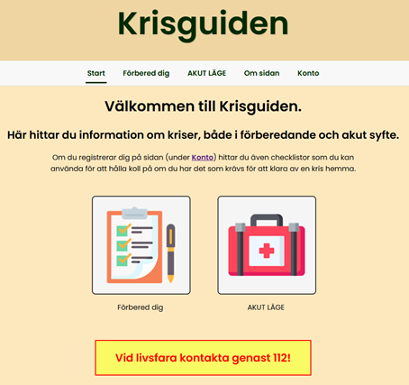
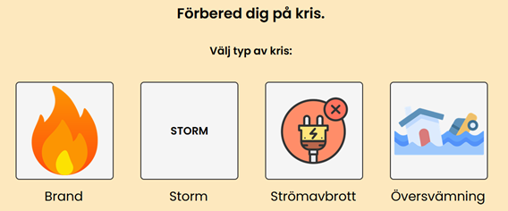
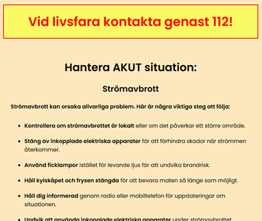
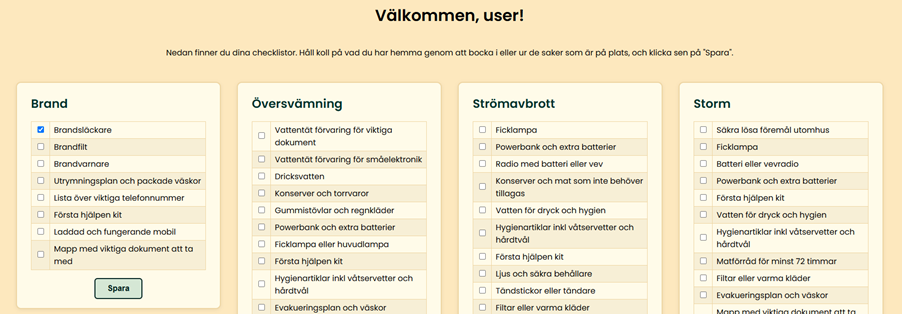

# Krisguiden

## Project status
The project will be on a hiatus beginning in June 2025 due to studies, but I will try to keep it going during longer free periods.
Since the aim of the course in which the project was born was to experience and learn about working in a project setting (like SCRUM for example), there are parts of the code base that is not really up to par (like the error handling) due to time running out. I do plan to fix this though. 
Some parts of the code is borrowed from my earlier projects, and I hope to make everything look a bit cleaner and more cohesive in the future.  

## Description
Krisguiden is a web application designed to help users prepare for and manage various emergency situations, such as fires, floods, storms, and power outages. The app provides checklists, preparation tips, and emergency information to help users stay safe and organized before, during, and after a crisis.
You can find more details about the project in the wiki, but note that all that documentation is in Swedish.  

## Installation
1. Clone the repository:
   ```bash
   git clone https://github.com/yourusername/krisguiden.git
   ```
2. Navigate to the project directory:
   ```bash
   cd krisguiden
   ```
3. Install dependencies:
   ```bash
   npm install
   ```
4. Set up environment variables as needed in a `.env` file.
5. Start the application:
   ```bash
   npm start
   ```

## Usage
- Visit `http://localhost:3000` in your browser after starting the app.
- Navigate through the sections for emergency checklists, preparation guides, and user dashboard.
- Register or log in to save your own checklists and track your preparation progress.

## Support
You can reach me at [my email](mailto:maria.elvira.jansson@gmail.com?subject=Regarding%20Krisguiden) if you have any questions, suggestions, or feedback!  

## Roadmap
Coming soon (I hope):
- Responsive design  
- Offline functionality  

## Contributing
Contributions are welcome! To contribute:
1. Fork the repository and create your branch from `main`.
2. Install dependencies with `npm install`.
3. Make your changes and add tests if applicable.
4. Run tests with `npm test` to ensure nothing is broken.
5. Submit a pull request with a clear description of your changes.

Please follow the code style and include relevant documentation for new features.

## License
This project is licensed under the MIT License. See the `LICENSE` file for details.

## Visuals
### **Front page**

### **Prepare navigation page**

### **Power outage emergency page**

### **Logged in user dashboard view**

